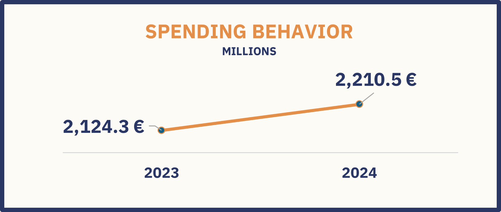
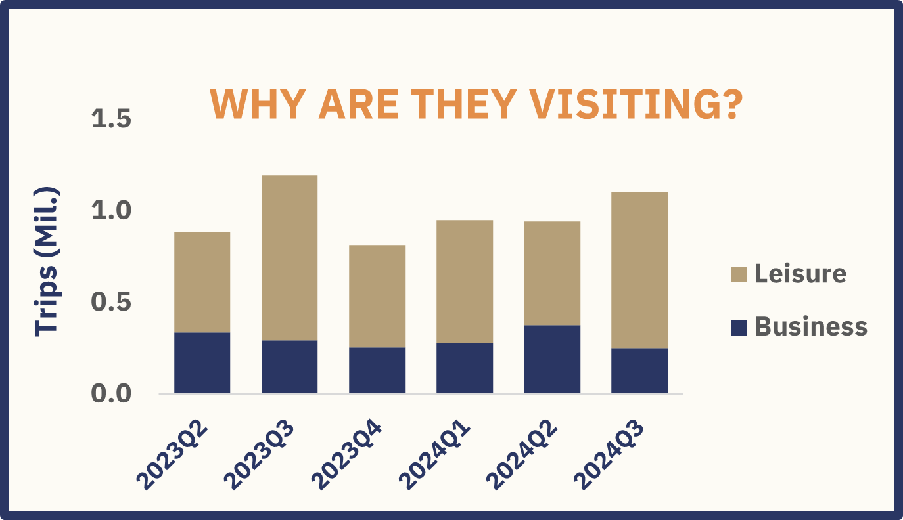
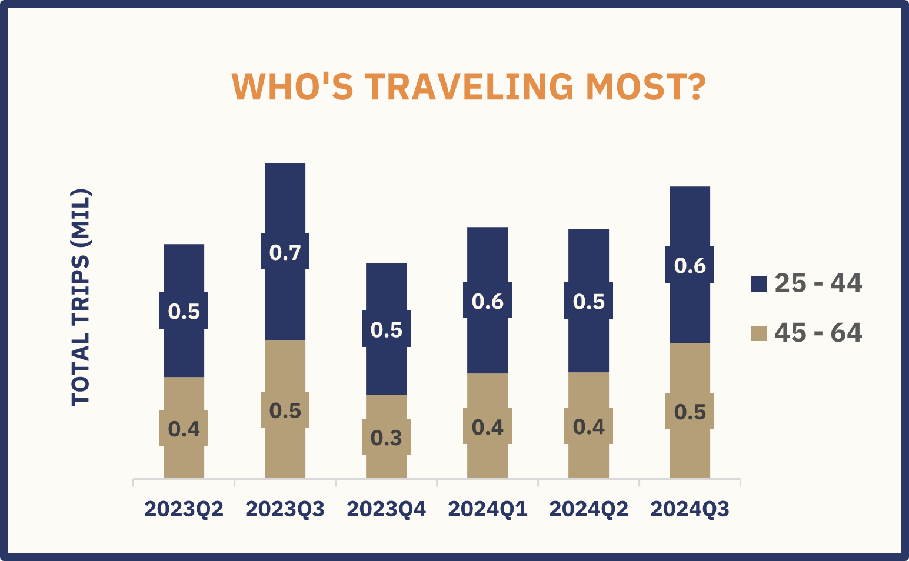
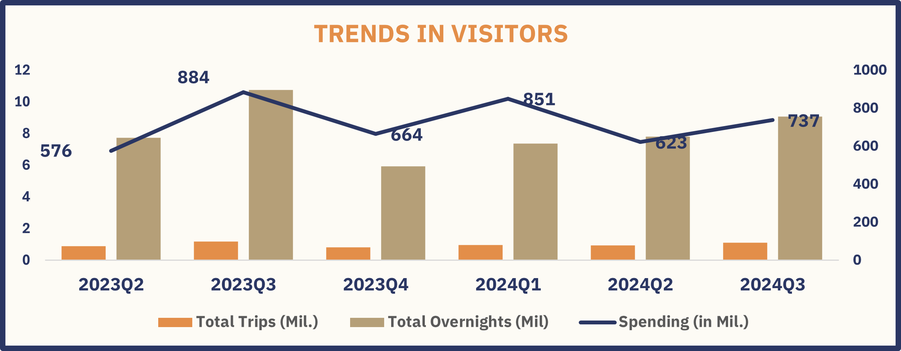
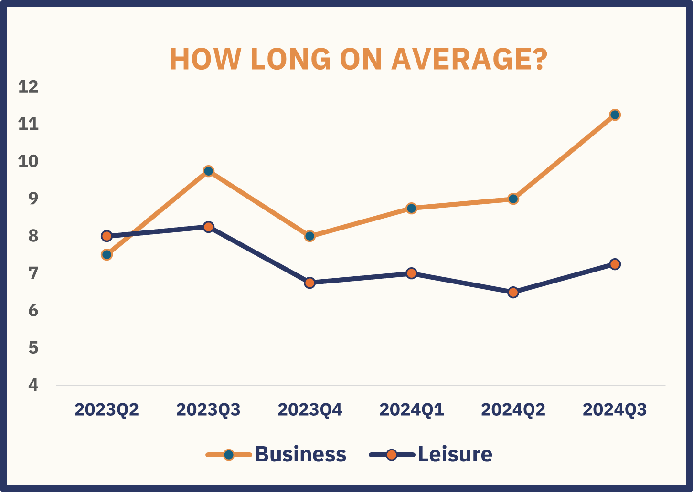
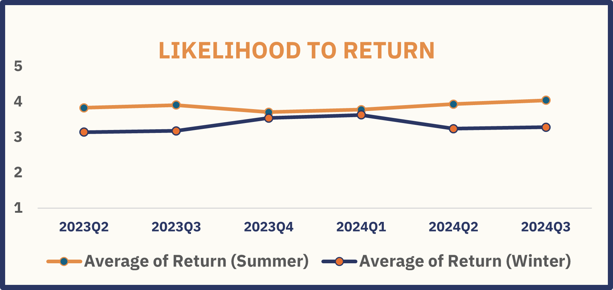

# Finland Tourism Recovery Analysis (2023–2024)

A post-pandemic analysis of **domestic tourism trends** in Finland using **Excel dashboards and pivot tables**.  

This project focuses on identifying key traveler behaviors, spending patterns, and recovery indicators across age, gender, and trip purpose.

> [Interactive Excel dashboard and pivot tables available in the attached file](Finland's_Post-Pandemic_Tourism.xlsx)

---

## Tourism Overview

Following the lifting of travel restrictions and revived traveler confidence, Finland has seen a steady recovery in domestic tourism.  

While the number of visitors may not have drastically surged, the **total revenue rose to €2.21 billion in 2024**, up 4.2% from 2023 — a clear sign that travelers are spending more per visit. This suggests that Finland has successfully repositioned itself as a destination for **longer, more meaningful travel**, attracting tourists with its unique blend of nature, safety, and cultural authenticity.

The data also reveals a **seasonal and demographic concentration**: summer is by far the busiest period, and travelers aged **25 to 44** dominate the market. These insights, along with the increasing average length of stay among **business travelers** (8.9 days), highlight Finland’s potential to grow both leisure and business tourism by aligning offers with traveler motivations.

---

## Detailed Insights with Quantified Metrics

### Tourism Revenue Increased to €2.21B in 2024

**Insight:**  
Revenue grew by 4.2% year-on-year despite modest changes in visitor numbers (1.5% increase to 3.8 million trips), signaling higher spending per tourist. The average spend per trip increased by 4.5%, reaching approximately €580. This could be due to longer stays, more premium travel experiences, or inflation-adjusted pricing.

---

### Most Trips Are Leisure-Related

**Insight:**  
Nature and wellness-based tourism dominate. Finland’s peaceful forests, lakes, and saunas continue to appeal to travelers seeking restorative, health-focused experiences—a trend amplified post-COVID. Leisure trips represent about 75% of all trips, with business trips accounting for the remaining 25%.

---

### Visitors Aged 25–44 Dominate

**Insight:**  
This group, likely professionals or digital nomads, values experiences, flexibility, and well-being. They make up **52% of total trips** and account for **57% of total spending**. Their tech-savviness and economic means make them ideal targets for immersive, high-value tourism campaigns.

---

### Summer 2023 Was the Busiest Quarter

**Insight:**  
Long daylight hours, outdoor festivals, and family-friendly conditions make summer the high season. Q3 alone accounted for **37% of total trips (1.4 million)** and **45% of overnight stays**. This reflects both local weather advantages and alignment with holidays in key source countries.

---

### Business Travelers Stay ~9 Days

**Insight:**  
Business trips to Finland tend to be extended, often merging professional and personal travel (“bleisure”). Average trip duration for business travelers is **8.9 days** compared to **4.3 days** for leisure trips. This maximizes the return on long-haul travel while boosting per-visitor revenue (€680 average spend vs. €560 for leisure).

---

### Summer Sees Higher Return Rates

**Insight:**  
Visitors who come during summer often return, with **48% expressing return intent**, which is 12 percentage points higher than the winter season (36%). This suggests that emotional connections formed during nature-filled summer experiences help build lasting tourist loyalty.

---

## Key Metrics and Segments Summary

| Metric                 | 2023         | 2024         | Change        |
|------------------------|--------------|--------------|---------------|
| Total Trips (Million)   | 3.74         | 3.80         | +1.5%         |
| Total Revenue (€ Billion) | 2.12         | 2.21         | +4.2%         |
| Average Trip Duration (Days) | 4.5          | 4.6          | +2.2%         |
| Average Spend per Trip (€) | 555          | 580          | +4.5%         |
| Return Intent (Summer)  | 43%          | 48%          | +5 percentage points |

**Segments:**

- **Age Groups:** 25–44 (dominant), 45–64  
- **Gender:** Male, Female  
- **Trip Purpose:** Leisure (75%), Business (25%)

---

## Summary of Insights

- Post-pandemic recovery is steady, driven by higher spending rather than sheer volume growth.  
- Finland’s image as a calm, safe, and wellness-focused destination resonates with traveler values.  
- The 25–44 age group is the most active, experience-driven segment ideal for digital and values-based marketing.  
- Summer is Finland’s peak tourism season, both for visits and repeat travelers.  
- Business travelers are increasingly blending work and leisure, staying longer, and contributing more revenue per visit.

---

## Recommendations & Next Steps

- **Promote summer travel packages:** Wellness retreats, cultural festivals, hiking tours for first-time and repeat visitors.  
- **Target the 25–44 leisure segment:** Design social media and content marketing campaigns highlighting Finland’s nature, tranquility, and uniqueness.  
- **Capitalize on ‘bleisure’ travelers:** Develop extended-stay offers or discounts to encourage business travelers to add leisure activities.  
- **Strengthen summer operations:** Scale staffing, infrastructure, and services to meet peak demand and deliver exceptional experiences.

---

## Tools Used

- **Excel** – Data cleaning, pivot tables, formulas (SUMIFS, COUNTIFS, etc.)  
- **Excel Dashboard** – Interactive slicers, KPI cards, visual storytelling  

---

## About the Analyst

Analyzing 2 years of domestic tourism data from Finland, I used Excel to clean, model, and visualize trends across demographics and trip purposes. Through pivot tables and KPIs, I tracked metrics such as trip counts, average spend, and return intent, enabling data-driven recommendations. This project sharpened my skills in delivering actionable, quantified insights for business impact.
