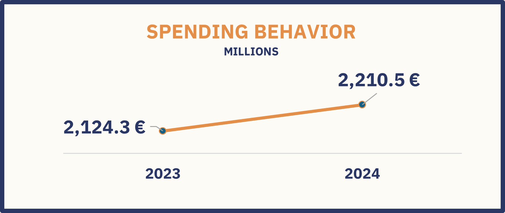
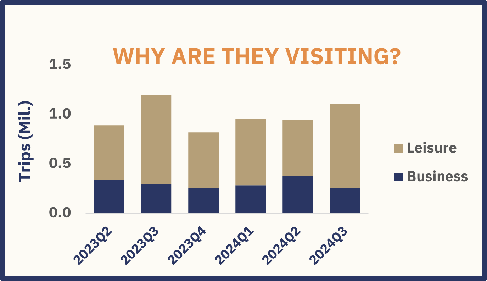
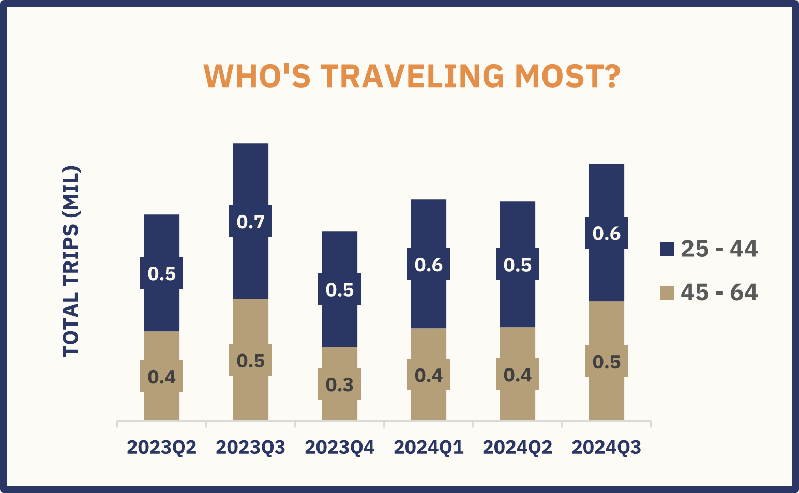
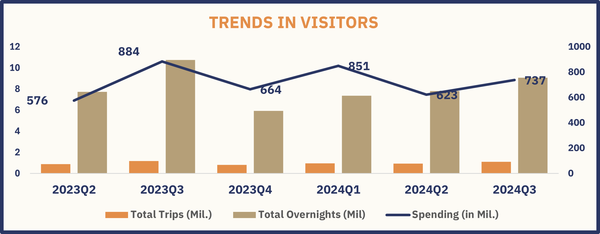
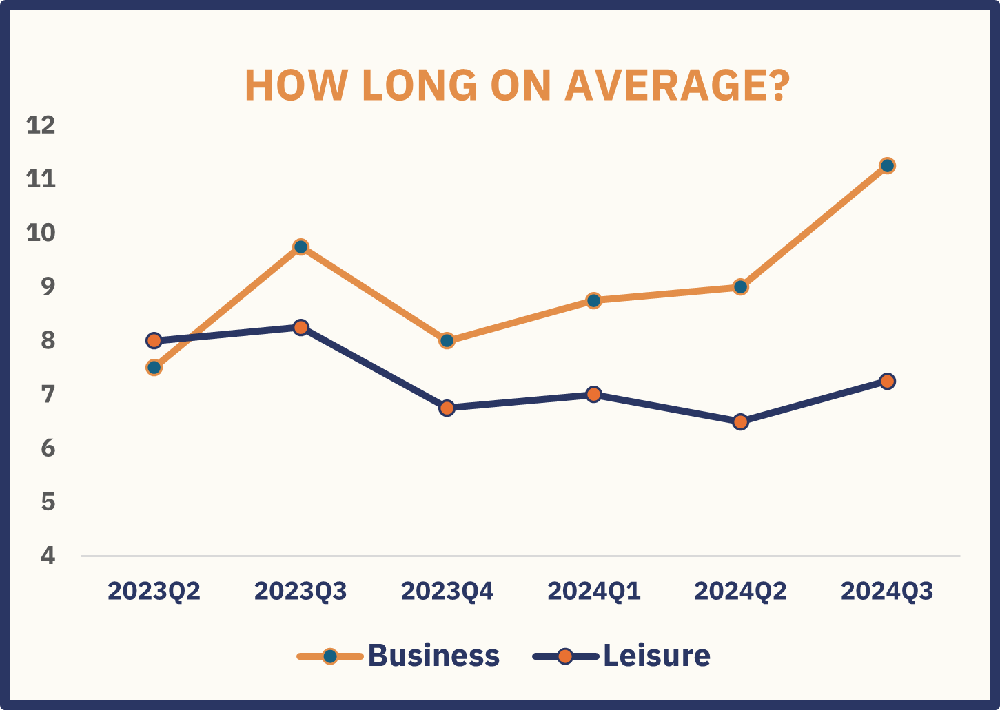
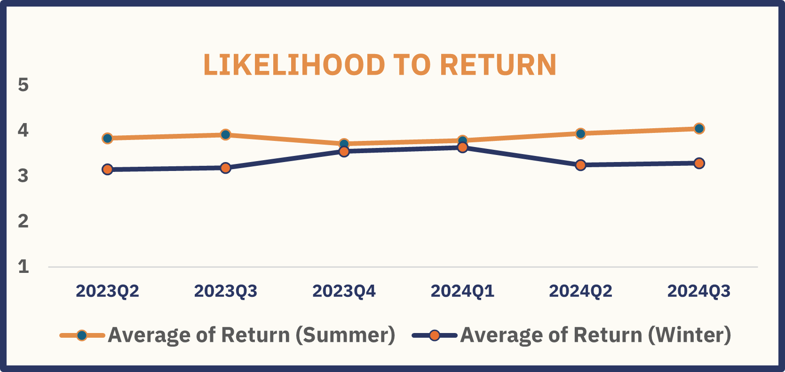

# Finland Tourism Recovery Analysis (2023–2024)

A post-pandemic analysis of inbound trips to Finland from abroad using Excel dashboards and pivot tables.

This project focused on identifying key traveler behaviors, spending patterns, and recovery indicators across working-age demographics, gender, and trip purpose.

> [Interactive Excel dashboard and pivot tables available in the attached file](Finland's_Post-Pandemic_Tourism.xlsx)

---

## Tourism Overview

Following the lifting of travel restrictions and the return of traveler confidence, Finland has seen a steady recovery in international visitor arrivals.

While the number of visitors may not have drastically increased, the total tourism revenue rose to **€2.21 billion** in 2024—an increase of **4.06%** from the previous year. This suggests that travelers arriving from abroad are spending more per visit, indicating a shift toward longer, more meaningful trips and a continued interest in Finland's nature, safety, and cultural authenticity.

Seasonality remains significant, with summer being the busiest period. A deeper look into specific demographics—particularly travelers aged **25–44** and **45–64**—revealed that this group contributes the majority of tourism revenue. These two age groups were prioritized in the analysis as they represent the core of the working population and are likely to have more stable income and travel patterns.

Notably, business-related travel has also stabilized, with an increasing average length of stay among working professionals, pointing to opportunities for targeted, value-driven tourism offerings.

---

## Key Insights

### Tourism Revenue Increased to **€2.21B** in 2024

**Insight:**  
Revenue grew by **4.06%** despite a modest **3.55% increase in visitor numbers** to **3.0 million trips**, signaling **higher spending per tourist**. The **average spend per trip increased by 0.49%**, reaching approximately **€736.59**. This could be due to longer stays, more premium travel experiences, or inflation-adjusted pricing.

---

### 70% of Trips Are Leisure-Related

**Insight:**  
Nature and wellness-based tourism dominate. Finland’s peaceful forests, lakes, and saunas continue to appeal to international travelers seeking restorative, health-focused experiences—a trend amplified post-COVID. **Leisure trips represent about 70%** of all trips, with **business trips accounting for the remaining 30%**.

---

### Visitors Aged **25–44** Dominate

**Insight:**  
This group, likely professionals or digital nomads, values experiences, flexibility, and well-being. They make up **57% of total trips** and account for **58% of total spending**. Their tech-savviness and economic means make them ideal targets for immersive, high-value tourism campaigns.

---

### **Summer 2023** Was the Busiest Quarter

**Insight:**  
Long daylight hours, outdoor festivals, and family-friendly conditions make summer the high season. **Q3 alone accounted for 20% of total trips (1.2 million)** and **22% of overnight stays**. This reflects both local weather advantages and alignment with holidays in key source countries.

---

### Business Travelers Stay Longer

**Insight:**  
Business trips to Finland tend to be extended, often merging professional and personal travel (“bleisure”). **Average trip duration for business travelers is 9 days** compared to **7.3 days for leisure trips**. This maximizes the return on long-haul travel while boosting **per-visitor revenue**.

---

### Summer Sees **Higher Return Rates**

**Insight:**  
**3.9/5** of travelers surveyed in summer 2024 indicated they intended to return—an increase of 2 percentage points compared to the previous year. This suggests that emotional connections formed during nature-filled summer experiences help build lasting tourist loyalty.

---

## Key Metrics and Segments Summary

| Metric                                | 2023  | 2024  | Change    |
|-------------------------------------|-------|-------|-----------|
| **Total Trips (in millions)**       | 2.9   | 3.0   | **+3.55%** |
| **Total Revenue (in € billions)**   | 2.12  | 2.21  | **+4.06%** |
| **Average Trip Duration Business (days)** | 8     | 10    | **+14.85%**  |
| **Average Spend per Trip (€)**      | 733.02   | 736.59   | **+0.49%** |
| **Return Intent (Summer)**           | 3.82/5 | 3.93/5 | **+0.1** |

*Note: Average Spend per Trip = Total Revenue ÷ Total Trips*

**Segments:**

**Focus: Working-age groups (25–64)** due to their financial stability, high travel activity, and influence on tourism trends.

- Age Groups: **25–44**, **45–64**  
- Gender: Male, Female  
- Purpose of Trip: Leisure, Business

---

## Summary of Insights

- Post-pandemic recovery is steady, driven by **higher spending rather than sheer volume growth**.  
- Finland’s image as a **calm, safe, and wellness-focused destination** resonates with traveler values.  
- The **25–44 age group** is the most active, experience-driven segment ideal for digital and values-based marketing.  
- **Summer is Finland’s peak tourism season**, both for visits and repeat travelers.  
- Business travelers are increasingly blending work and leisure, staying longer, and contributing more revenue per visit.

---

## Recommendations & Next Steps

- **Promote summer travel packages:** Wellness retreats, cultural festivals, hiking tours for first-time and repeat visitors.  
- **Target the 25–44 leisure segment:** Design social media and content marketing campaigns highlighting Finland’s nature, tranquility, and uniqueness.  
- **Capitalize on ‘bleisure’ travelers:** Develop extended-stay offers or discounts to encourage business travelers to add leisure activities.  
- **Strengthen summer operations:** Scale staffing, infrastructure, and services to meet peak demand and deliver exceptional experiences.

---

## Tools Used

- Excel: Data cleaning, transformation, and calculation  
- Pivot Tables: For aggregation and exploration by year, demographic, and purpose  
- Interactive Dashboard: With slicers to filter by age group, gender, and trip type

---

## About the Analyst

Analyzing 2 years of international visitor data to Finland, I used Excel to clean, model, and visualize trends across demographics and trip purposes. Through pivot tables and KPIs, I tracked metrics such as trip counts, average spend, and return intent, enabling data-driven recommendations. This project sharpened my skills in delivering actionable, quantified insights for business impact.
